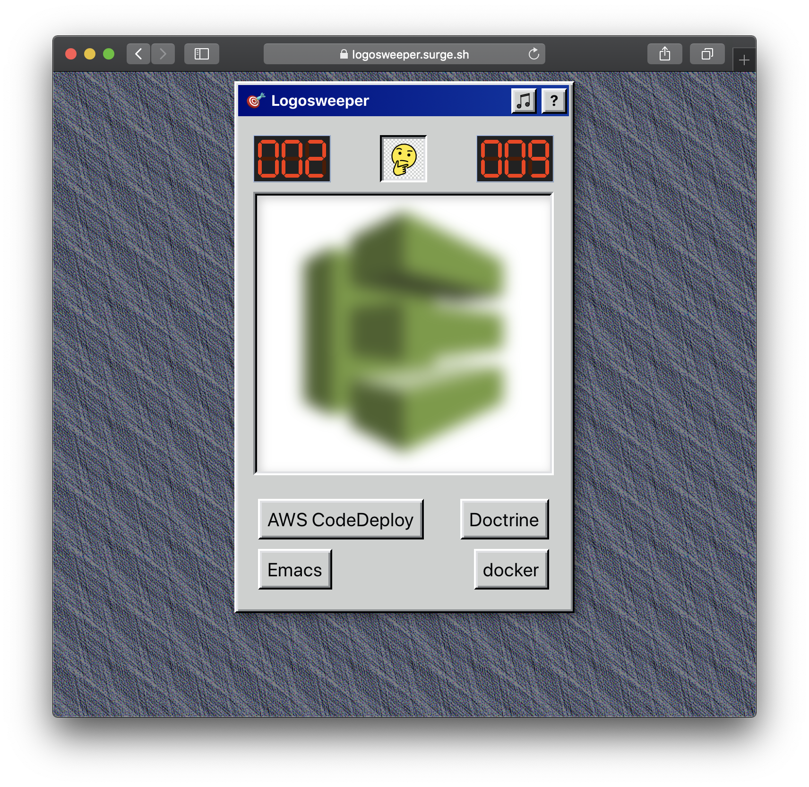

# 🎯 Logosweeper

A tech logo guess game made with React.

## Screenshots




## Build locally

```
$ npm install
$ yarn start
```

## Tech used

* Logos repository by gilbarbara's [SVG Logos](https://github.com/gilbarbara/logos) <3
* Windows 95 React Components: [arturbien/React95
](https://github.com/arturbien/React95)
* Score component: [joshwcomeau/react-retro-hit-counter](https://github.com/joshwcomeau/react-retro-hit-counter)
* CSS Animation: [Animate.css](https://daneden.github.io/animate.css)
* [OpenMoji](https://openmoji.org)
* Windows 95 [wallpapers repository](http://dvd3000.000webhostapp.com/WIN95.html)
* 3 audio chimes are from the game [Yoda Stories](https://en.wikipedia.org/wiki/Star_Wars:_Yoda_Stories) (let's see if I will receive a _cease and desist_ from Disney lol)

## About

This app was made just as a small project to learn [React](https://reactjs.org/). If you have suggestions, tips or rants please open an *issue* so I can fix and learn something ;)

All logos appearing on this app are property of their respective owners.

## License

[MIT](LICENSE.txt)
